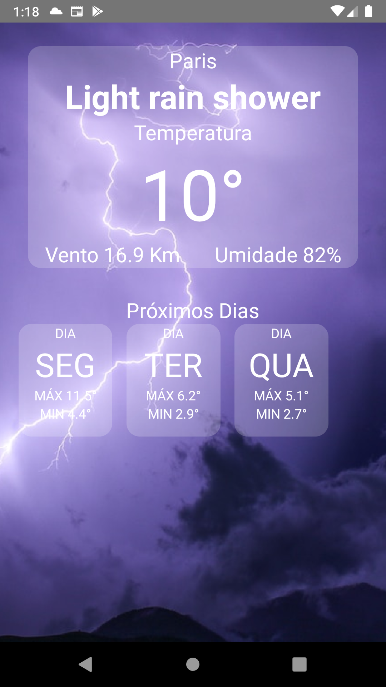
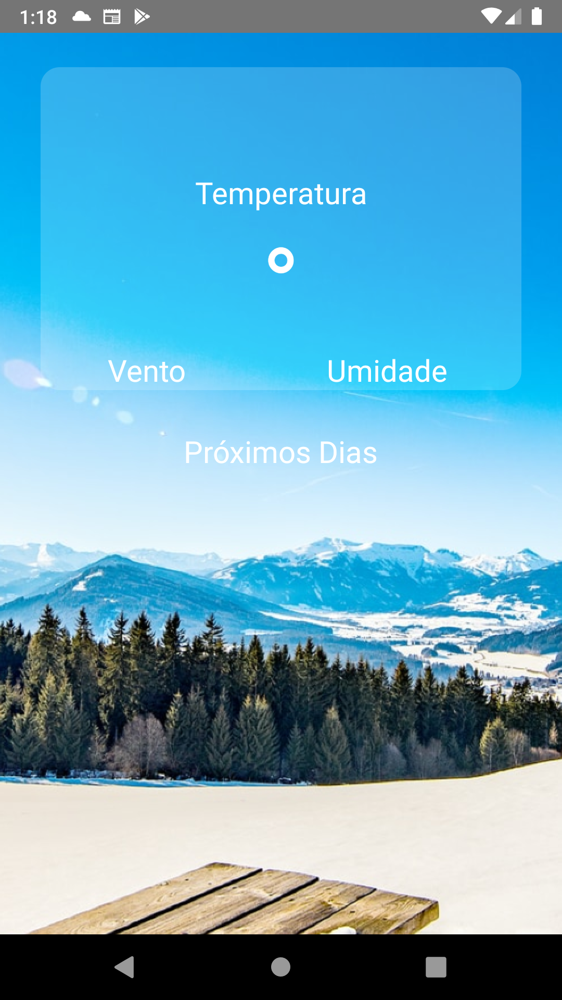

# MyClimate

App para Android e IOS construído com React Native utilizando a lib [WeatherAPI](https://www.weatherapi.com/) para exibir informações sobre o clima local. <br>
Os dados informados são obtidos através da localização do usuário obtida através da lib [
react-native-geolocation-service](https://github.com/Agontuk/react-native-geolocation-service).

## Licença

[](https://opensource.org/licenses/MIT)

## Tecnologias utilizadas


## Prints das Telas





## Como executar o projeto
Pré-requisitos npm/yarn

## Chave de API
A lib exige uma chave que precisa ser cadastrada no site e deve ser enviada juntamente com as requisições para o recebimento das informações sobre o clima. Essa chave deve ser substituída no código do projeto no path -> src/Api/index.js sobrescervendo a variável API_KEY.

## Instalação das bibliotecas

```bash 
# 1- Lib de geolocalização
yarn add react-native-geolocation-service 
ou
npm install react-native-geolocation-service

# 2-Axios
npm install axios
ou
yarn add axios


```
## Baixando o projeto 
```bash
# 1- Clonar o repositório
git clone https://github.com/thiagosouzasi/MyClimate.git

# 2- Entre na pasta do projeto
cd pdf-report

# 3- executar o projeto
yarn start

```


## Autor
Thiago Souza <br>
[](https://www.linkedin.com/in/thiago-ramos-de-souza-42804ab1/)
[](https://www.instagram.com/prof_thiago_souza/)